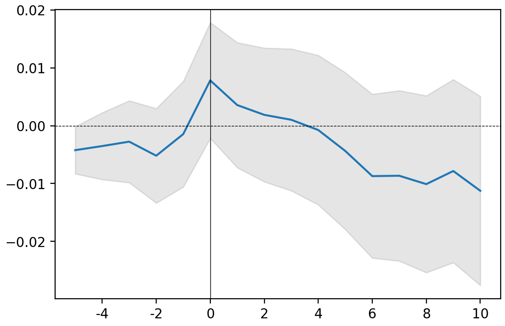
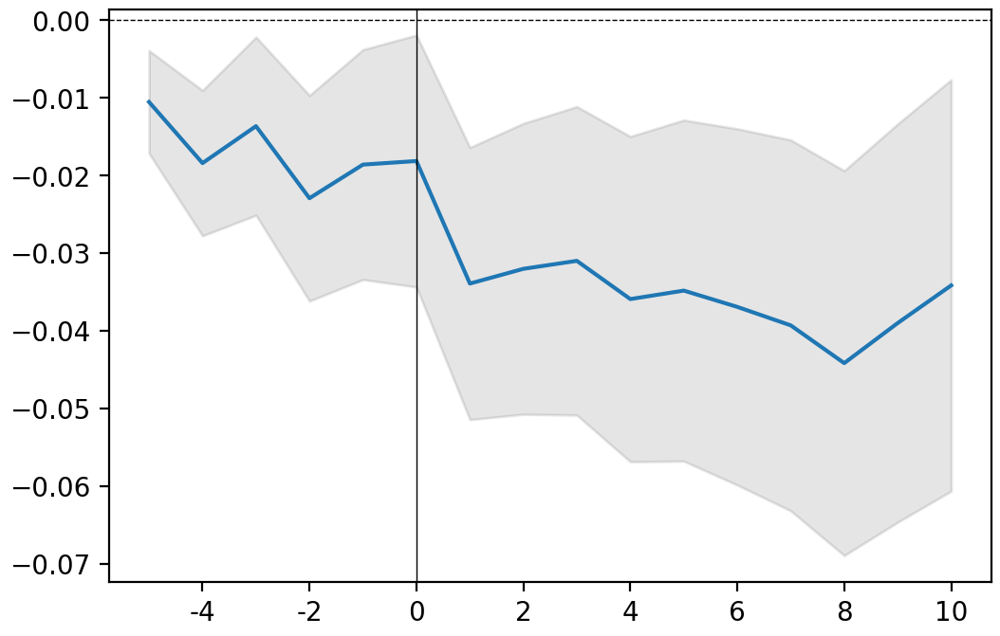
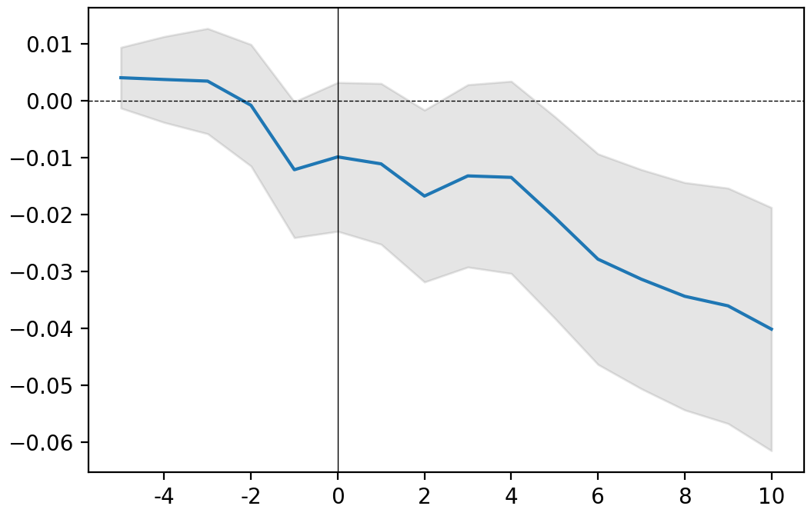
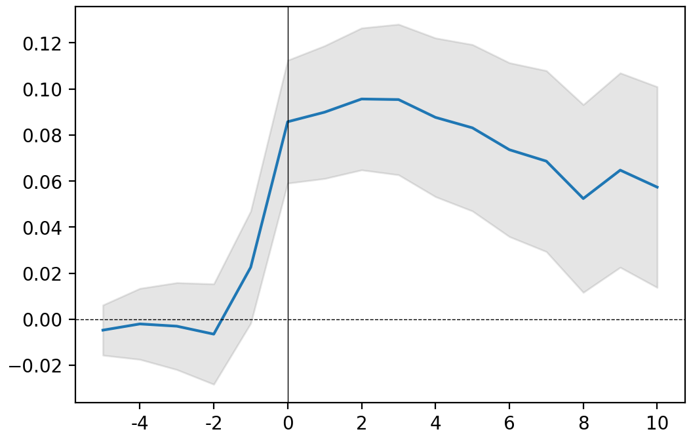
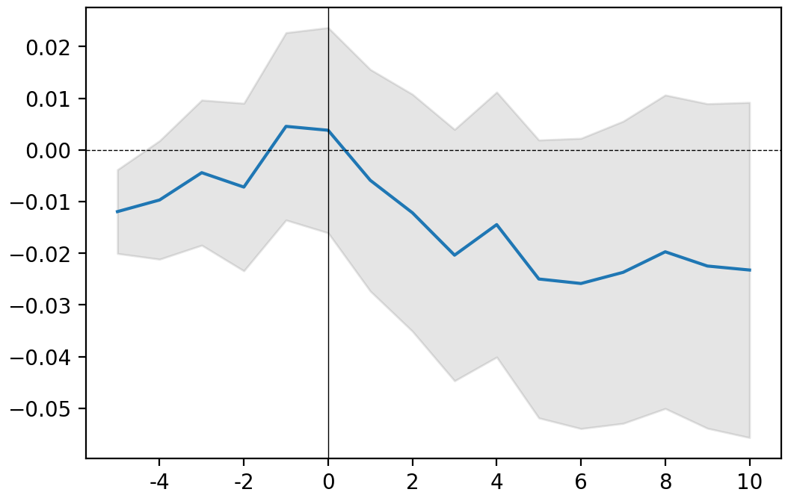
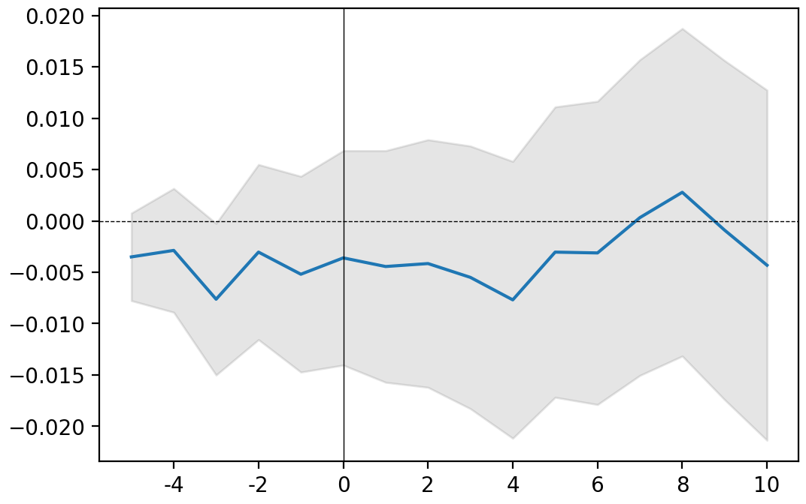

# Get Started

Through two examples, we will discover how to perform 
an event study analysis on a single event or on an aggregate of events.

```eval_rst
.. contents::
    :local:
    :depth: 1

.. note::
    You can use the `interactive version <https://mybinder.org/v2/gh/LemaireJean-Baptiste/eventstudy/master?filepath=example%2FEventstudy%20Example.ipynb>`_ of this tutorial to play with the functions yourself.
```

## Preliminary work

1. Load the `eventstudy` module and its dependencies: `numpy` and `matplotlib`:
    ```Python
    import eventstudy as es
    import numpy as np
    import matplotlib.pyplot as plt
    ```

2. Set the parameters needed for your events: 
    the returns and Fama-French factors (using `es.Single.import_returns()`and `es.Single.import_FamaFrench()`):
    ```Python
    es.Single.import_returns('returns.csv')
    es.Single.import_FamaFrench('famafrench.csv')
    ```

## Example 1: A single event
As an introductory example, we will compute the event study 
analysis of the announcement of the first iphone,
made by Steve Jobs during MacWorld exhibition, on January 7, 2007.

1. Run the event study, here using the Fama-French 3-factor model:
    ```Python
    event = es.Single.FamaFrench_3factor(
        security_ticker = 'AAPL',
        event_date = np.datetime64('2013-03-04'),
        event_window = (-2,+10), 
        estimation_size = 300,
        buffer_size = 30
    )
    ```

    ```eval_rst
    .. note::
        You can easily play with the parameters and adjust the event study analysis to your needs.

        For more details, see the documentation on `FamaFrench_3factor function <api/eventstudy.Single.FamaFrench_3factor>`_.

        See also `other models' function <api/eventstudy.Models>`_.
        You can even `set your own modelisation functions <extend.html>`_
    ```

2. Display results:
    - In a plot:
    ```Python
    event.plot(AR=True)
    plt.show() # use standard matplotlib function to display the plot
    ```

    

    *grey area: confidence interval (here at 90%); blue line: CAAR; black bars: AR*

    ```eval_rst
    .. note::
        You can remove the confidence interval (set `CI = False`) or
        change its level of confidence (set `confidence = .95` for a confidence interval at 95%).

        By default AR are note displayed (set `AR = True` to add them to the plot).

        For more details, see the documentation on `plot function <api/eventstudy.Single.plot>`_ .
    ```
    - Or in a table:
    ```Python
    event.results(decimals=[3,5,3,5,2,2])
    ```

|    |     AR |   Variance AR | CAR        |   Variance CAR |   T-stat |   P-value |
|---:|-------:|--------------:|:-----------|---------------:|---------:|----------:|
| -5 | -0.053 |       0.00048 | -0.053 **  |        0.00048 |    -2.42 |      0.01 |
| -4 |  0.012 |       0.00048 | -0.041 *   |        0.00096 |    -1.33 |      0.09 |
| -3 | -0.013 |       0.00048 | -0.055 *   |        0.00144 |    -1.43 |      0.08 |
| -2 |  0.004 |       0.00048 | -0.051     |        0.00192 |    -1.15 |      0.13 |
| -1 |  0     |       0.00048 | -0.051     |        0.00241 |    -1.03 |      0.15 |
|  0 | -0.077 |       0.00048 | -0.128 **  |        0.00289 |    -2.37 |      0.01 |
|  1 | -0.039 |       0.00048 | -0.167 *** |        0.00337 |    -2.88 |      0    |
|  2 |  0.027 |       0.00048 | -0.14 **   |        0.00385 |    -2.26 |      0.01 |
|  3 |  0.024 |       0.00048 | -0.116 **  |        0.00433 |    -1.77 |      0.04 |
|  4 | -0.024 |       0.00048 | -0.14 **   |        0.00481 |    -2.02 |      0.02 |
|  5 |  0.023 |       0.00048 | -0.117 *   |        0.00529 |    -1.61 |      0.05 |
|  6 |  0.057 |       0.00048 | -0.06      |        0.00577 |    -0.79 |      0.21 |
|  7 |  0.011 |       0.00048 | -0.049     |        0.00626 |    -0.62 |      0.27 |
|  8 |  0.011 |       0.00048 | -0.038     |        0.00674 |    -0.46 |      0.32 |
|  9 |  0.017 |       0.00048 | -0.021     |        0.00722 |    -0.24 |      0.4  |
| 10 |  0.003 |       0.00048 | -0.018     |        0.0077  |    -0.2  |      0.42 |
| 11 | -0.01  |       0.00048 | -0.028     |        0.00818 |    -0.31 |      0.38 |
| 12 |  0.008 |       0.00048 | -0.02      |        0.00866 |    -0.21 |      0.42 |
| 13 | -0.009 |       0.00048 | -0.028     |        0.00914 |    -0.3  |      0.38 |
| 14 |  0.012 |       0.00048 | -0.016     |        0.00962 |    -0.16 |      0.43 |
| 15 |  0.011 |       0.00048 | -0.005     |        0.01011 |    -0.05 |      0.48 |
| 16 |  0.024 |       0.00048 | 0.018      |        0.01059 |     0.18 |      0.43 |
| 17 |  0.001 |       0.00048 | 0.019      |        0.01107 |     0.18 |      0.43 |
| 18 |  0.009 |       0.00048 | 0.028      |        0.01155 |     0.26 |      0.4  |
| 19 | -0.002 |       0.00048 | 0.026      |        0.01203 |     0.24 |      0.41 |
| 20 | -0.02  |       0.00048 | 0.006      |        0.01251 |     0.06 |      0.48 |

```eval_rst
.. note::
    Asterisks are added automatically to highlight the level of significance
    (Significance level: \*\*\* at 99%, \*\* at 95%, \* at 90%). 
    You can remove asterisks by setting `asterisks` parameter at `False`.

    `decimals` is a list of integer setting for each column (except index) the rounding decimal. 
    You can also set one integer (e.g. `decimals = 3`) if you want all columns to be rounded the same.

    See the documentation on this `results function <api/eventstudy.Single.results>`_ for more details.
```

## Example 2: An aggregate of events

The eventstudy package offer three different entry points.
The list of events can be provided using a csv file, a plain python text or a python list.

In this second example, based on the same data and preliminary work, we will
compute an event study on GAFA annual report (10-K form) releases.

### Data preparation

The first step is to gather the data about the events and to format it.
For the purpose of this example we will use the csv file methods.
The csv file must contains all information needed to compute the model.

The event study will be computed using the market model. According to the (/api/eventstudy.Single.market_model.html#eventstudy.Single.market_model)[API documentation] aside from event study parameters which will be set globally for all events (event_window, estimation_size and buffer_size), the market model needs the security_ticker, the market_ticker and the event_date parameters.

Thus, the csv file should contain three columns with the exact same names as the parameter names.

```eval_rst
.. note::
    The csv file must use comma (',') as separator.
```

| security_ticker | market_ticker | event_date |
|------|-----|------------|
| AAPL | SPY | 31/10/2019 |
| AAPL | SPY | 05/11/2018 |
| AAPL | SPY | 03/11/2017 |
| AAPL | SPY | 26/10/2016 |
| AAPL | SPY | 28/10/2015 |
| AAPL | SPY | 27/10/2014 |
| AAPL | SPY | 30/10/2013 |
| AAPL | SPY | 31/10/2012 |
| AAPL | SPY | 26/10/2011 |
| AAPL | SPY | 27/10/2010 |
| GOOG | SPY | 04/02/2020 |
| GOOG | SPY | 05/02/2019 |
| GOOG | SPY | 06/02/2018 |
| GOOG | SPY | 03/02/2017 |
| GOOG | SPY | 11/02/2016 |
| AMZN | SPY | 31/01/2020 |
| AMZN | SPY | 01/02/2019 |
| AMZN | SPY | 02/02/2018 |
| AMZN | SPY | 10/02/2017 |
| AMZN | SPY | 29/01/2016 |
| AMZN | SPY | 30/01/2015 |
| AMZN | SPY | 30/01/2013 |
| AMZN | SPY | 01/02/2012 |
| AMZN | SPY | 28/01/2011 |
| AMZN | SPY | 29/01/2010 |
| MSFT | SPY | 01/08/2019 |
| MSFT | SPY | 03/08/2018 |
| MSFT | SPY | 02/08/2017 |
| MSFT | SPY | 28/07/2016 |
| MSFT | SPY | 31/07/2015 |
| MSFT | SPY | 31/07/2014 |
| MSFT | SPY | 30/07/2013 |
| MSFT | SPY | 26/07/2012 |
| MSFT | SPY | 28/07/2011 |
| MSFT | SPY | 30/07/2010 |
| FB   | SPY | 30/01/2020 |
| FB   | SPY | 31/01/2019 |
| FB   | SPY | 01/02/2018 |
| FB   | SPY | 28/01/2016 |
| FB   | SPY | 29/01/2015 |
| FB   | SPY | 31/01/2014 |

### Event study computation

To create an event study analysis of an aggregate of events, we will use the `Multiple` class.
This class is designed following the same spirit and structure of the `Single` class.

Run the event study using the csv importer method:

```Python
release_10K = es.Multiple.from_csv(
    path = '10K.csv', # the path to the csv file created
    event_study_model = es.Single.market_model,
    event_window = (-5,+10),
    estimation_size = 200,
    buffer_size = 30,
    date_format = '%d/%m/%Y',
    ignore_errors = True
)
```

```eval_rst
.. note::

    The event_study_model parameter must point to a function. This function can either be a model function provided by the `Single` class or a user-defined function. 

    When the ignore_errors parameter is set to `True` (which is its default value), the event study analysis will be computed regardless of any error encounter. Event triggering an error will be remove of the sample. Use `error_report method <api/eventstudy.Multiple.error_report>`_ to get the full list of error and their explanation. Errors are often coming from data unavailability.

    Set the ignore_errors to False if you prefer the analysis to stop at the first error.
```

### Display results:

- In a plot:
```Python
release_10K.plot(confidence=.95)
plt.show() # use standard matplotlib function to display the plot
```



*grey area: confidence interval (here defined by the user at 95%); blue line: CAAR*

- Or in a table:
```Python
release_10K.results(decimals=[3,5,3,5,2,2])
```

|    |    AAR |   Variance AAR | CAAR      |   Variance CAAR |   T-stat |   P-value |
|---:|-------:|---------------:|:----------|----------------:|---------:|----------:|
| -5 | -0.004 |          1e-05 | -0.004 ** |          1e-05  |    -1.7  |      0.04 |
| -4 |  0.001 |          1e-05 | -0.004    |          1e-05  |    -1    |      0.16 |
| -3 |  0.001 |          1e-05 | -0.003    |          2e-05  |    -0.64 |      0.26 |
| -2 | -0.002 |          1e-05 | -0.005    |          2e-05  |    -1.04 |      0.15 |
| -1 |  0.004 |          1e-05 | -0.001    |          3e-05  |    -0.26 |      0.4  |
|  0 |  0.009 |          1e-05 | 0.008     |          4e-05  |     1.29 |      0.1  |
|  1 | -0.004 |          1e-05 | 0.004     |          4e-05  |     0.54 |      0.29 |
|  2 | -0.002 |          1e-05 | 0.002     |          5e-05  |     0.27 |      0.39 |
|  3 | -0.001 |          1e-05 | 0.001     |          6e-05  |     0.14 |      0.45 |
|  4 | -0.002 |          1e-05 | -0.001    |          6e-05  |    -0.1  |      0.46 |
|  5 | -0.004 |          1e-05 | -0.004    |          7e-05  |    -0.53 |      0.3  |
|  6 | -0.004 |          1e-05 | -0.009    |          7e-05  |    -1.01 |      0.16 |
|  7 |  0     |          1e-05 | -0.009    |          8e-05  |    -0.97 |      0.17 |
|  8 | -0.001 |          1e-05 | -0.01     |          9e-05  |    -1.09 |      0.14 |
|  9 |  0.002 |          1e-05 | -0.008    |          9e-05  |    -0.81 |      0.21 |
| 10 | -0.003 |          1e-05 | -0.011    |          0.0001 |    -1.13 |      0.13 |

```eval_rst
.. note::
    Asterisks are added automatically to highlight the level of significance
    (Significance level: \*\*\* at 99%, \*\* at 95%, \* at 90%). 
    You can remove asterisks by setting `asterisks` parameter at `False`.

    `decimals` is a list of integer setting for each column (except index) the rounding decimal. 
    You can also set one integer (e.g. `decimals = 3`) if you want all columns to be rounded the same.

    See the documentation on this `results function <api/eventstudy.Multiple.results>`_ for more details.
```

- Get CAR distribution:
```Python
release_10K.get_CAR_dist(4)
```

|    |    Mean |   Variance |   Kurtosis |     Min |   Quantile 25% |   Quantile 50% |   Quantile 75% |    Max |
|---:|--------:|-----------:|-----------:|--------:|---------------:|---------------:|---------------:|-------:|
| -5 | -0.0042 |     0.0003 |     0.7127 | -0.0463 |        -0.0098 |        -0.005  |         0.0045 | 0.0373 |
| -4 | -0.0035 |     0.0006 |    -0.1992 | -0.0595 |        -0.0151 |         0.0006 |         0.0091 | 0.0515 |
| -3 | -0.0028 |     0.0009 |     0.0228 | -0.0839 |        -0.0231 |        -0.0052 |         0.0185 | 0.0627 |
| -2 | -0.0052 |     0.0007 |    -0.0799 | -0.0631 |        -0.0209 |        -0.0078 |         0.007  | 0.0574 |
| -1 | -0.0015 |     0.0012 |     0.2771 | -0.0705 |        -0.0221 |        -0.008  |         0.0158 | 0.0868 |
|  0 |  0.0078 |     0.0036 |     1.5911 | -0.1059 |        -0.0271 |         0.0022 |         0.0224 | 0.2023 |
|  1 |  0.0036 |     0.0043 |     1.1048 | -0.103  |        -0.0378 |        -0.012  |         0.0212 | 0.2108 |
|  2 |  0.0019 |     0.0048 |     0.2683 | -0.0974 |        -0.0383 |        -0.0163 |         0.0312 | 0.1854 |
|  3 |  0.001  |     0.0051 |     0.5488 | -0.1184 |        -0.0415 |        -0.0181 |         0.0289 | 0.196  |
|  4 | -0.0007 |     0.005  |     0.6936 | -0.1127 |        -0.0413 |        -0.0199 |         0.0238 | 0.2054 |
|  5 | -0.0044 |     0.0055 |     0.7422 | -0.1586 |        -0.0412 |        -0.0178 |         0.0253 | 0.2121 |
|  6 | -0.0087 |     0.0057 |     0.7992 | -0.1747 |        -0.0439 |        -0.0215 |         0.0234 | 0.2106 |
|  7 | -0.0087 |     0.0056 |     0.8942 | -0.1896 |        -0.047  |        -0.0175 |         0.027  | 0.2005 |
|  8 | -0.0101 |     0.0054 |     0.8968 | -0.1736 |        -0.0481 |        -0.0172 |         0.025  | 0.2064 |
|  9 | -0.0078 |     0.0052 |     0.5841 | -0.1534 |        -0.0481 |        -0.0122 |         0.03   | 0.1969 |
| 10 | -0.0113 |     0.0057 |     0.7229 | -0.175  |        -0.0522 |        -0.0153 |         0.0227 | 0.2034 |

## Bonus: Loop in event

The true strengh of this package is to use python. You can create complex algorithms to compute programatically event stuy analyses. From the same data as above, we will compute an event study of 10-K form releases for each company.

### Data preparation
This time, we will use the `eventstudy.Multiple.from_list` method which set event list using a python list. This let the user manipulate the list of event before computing event studies.

This list must contains all parameters needed to compute the selected model (here we will use the Fama-French 3-factor model). The Fama-French factors' data has to be set using the `eventstudy.Single.import_FamaFrench` method (see preliminary step).

```Python
events_db = [
    {'security_ticker': 'AAPL', 'market_ticker': 'SPY', 'event_date': np.datetime64('2019-10-31')},
    {'security_ticker': 'AAPL', 'market_ticker': 'SPY', 'event_date': np.datetime64('2018-11-05')},
    {'security_ticker': 'AAPL', 'market_ticker': 'SPY', 'event_date': np.datetime64('2017-11-03')},
    {'security_ticker': 'AAPL', 'market_ticker': 'SPY', 'event_date': np.datetime64('2016-10-26')},
    {'security_ticker': 'AAPL', 'market_ticker': 'SPY', 'event_date': np.datetime64('2015-10-28')},
    {'security_ticker': 'AAPL', 'market_ticker': 'SPY', 'event_date': np.datetime64('2014-10-27')},
    {'security_ticker': 'AAPL', 'market_ticker': 'SPY', 'event_date': np.datetime64('2013-10-30')},
    {'security_ticker': 'AAPL', 'market_ticker': 'SPY', 'event_date': np.datetime64('2012-10-31')},
    {'security_ticker': 'AAPL', 'market_ticker': 'SPY', 'event_date': np.datetime64('2011-10-26')},
    {'security_ticker': 'AAPL', 'market_ticker': 'SPY', 'event_date': np.datetime64('2010-10-27')},
    {'security_ticker': 'GOOG', 'market_ticker': 'SPY', 'event_date': np.datetime64('2020-02-04')},
    {'security_ticker': 'GOOG', 'market_ticker': 'SPY', 'event_date': np.datetime64('2019-02-05')},
    {'security_ticker': 'GOOG', 'market_ticker': 'SPY', 'event_date': np.datetime64('2018-02-06')},
    {'security_ticker': 'GOOG', 'market_ticker': 'SPY', 'event_date': np.datetime64('2017-02-03')},
    {'security_ticker': 'GOOG', 'market_ticker': 'SPY', 'event_date': np.datetime64('2016-02-11')},
    {'security_ticker': 'FB', 'market_ticker': 'SPY', 'event_date': np.datetime64('2020-01-30')},
    {'security_ticker': 'FB', 'market_ticker': 'SPY', 'event_date': np.datetime64('2019-01-31')},
    {'security_ticker': 'FB', 'market_ticker': 'SPY', 'event_date': np.datetime64('2018-02-01')},
    {'security_ticker': 'FB', 'market_ticker': 'SPY', 'event_date': np.datetime64('2016-01-28')},
    {'security_ticker': 'FB', 'market_ticker': 'SPY', 'event_date': np.datetime64('2015-01-29')},
    {'security_ticker': 'FB', 'market_ticker': 'SPY', 'event_date': np.datetime64('2014-01-31')},
    {'security_ticker': 'AMZN', 'market_ticker': 'SPY', 'event_date': np.datetime64('2020-01-31')},
    {'security_ticker': 'AMZN', 'market_ticker': 'SPY', 'event_date': np.datetime64('2019-02-01')},
    {'security_ticker': 'AMZN', 'market_ticker': 'SPY', 'event_date': np.datetime64('2018-02-02')},
    {'security_ticker': 'AMZN', 'market_ticker': 'SPY', 'event_date': np.datetime64('2017-02-10')},
    {'security_ticker': 'AMZN', 'market_ticker': 'SPY', 'event_date': np.datetime64('2016-01-29')},
    {'security_ticker': 'AMZN', 'market_ticker': 'SPY', 'event_date': np.datetime64('2015-01-30')},
    {'security_ticker': 'AMZN', 'market_ticker': 'SPY', 'event_date': np.datetime64('2013-01-30')},
    {'security_ticker': 'AMZN', 'market_ticker': 'SPY', 'event_date': np.datetime64('2012-02-01')},
    {'security_ticker': 'AMZN', 'market_ticker': 'SPY', 'event_date': np.datetime64('2011-01-28')},
    {'security_ticker': 'AMZN', 'market_ticker': 'SPY', 'event_date': np.datetime64('2010-01-29')},
    {'security_ticker': 'MSFT', 'market_ticker': 'SPY', 'event_date': np.datetime64('2019-08-01')},
    {'security_ticker': 'MSFT', 'market_ticker': 'SPY', 'event_date': np.datetime64('2018-08-03')},
    {'security_ticker': 'MSFT', 'market_ticker': 'SPY', 'event_date': np.datetime64('2017-08-02')},
    {'security_ticker': 'MSFT', 'market_ticker': 'SPY', 'event_date': np.datetime64('2016-07-28')},
    {'security_ticker': 'MSFT', 'market_ticker': 'SPY', 'event_date': np.datetime64('2015-07-31')},
    {'security_ticker': 'MSFT', 'market_ticker': 'SPY', 'event_date': np.datetime64('2014-07-31')},
    {'security_ticker': 'MSFT', 'market_ticker': 'SPY', 'event_date': np.datetime64('2013-07-30')},
    {'security_ticker': 'MSFT', 'market_ticker': 'SPY', 'event_date': np.datetime64('2012-07-26')},
    {'security_ticker': 'MSFT', 'market_ticker': 'SPY', 'event_date': np.datetime64('2011-07-28')},
    {'security_ticker': 'MSFT', 'market_ticker': 'SPY', 'event_date': np.datetime64('2010-07-30')}
]
```

### Event studies computation
Using a list comprehension, the full list of events can be filtered to create one list per company's ticker. Then we can compute for each company, the event study using the Fama-French 3 factor model and store each event study in a `releases` dictionary.
```Python 
tickers = ['GOOG', 'AAPL', 'FB', 'AMZN', 'MSFT']
releases = dict()

for ticker in tickers:
    events = [event for event in events_db if event['security_ticker']==ticker]
    
    releases[ticker] = es.Multiple.from_list(
        events,
        es.Single.FamaFrench_3factor,
        event_window= (-5,+10)
    )
```

### Display results
    
```Python 
for ticker, event in releases.items():
    print(ticker)
    event.plot()
    plt.show()
```

GOOG


AAPL


FB


AMZN


MSFT
